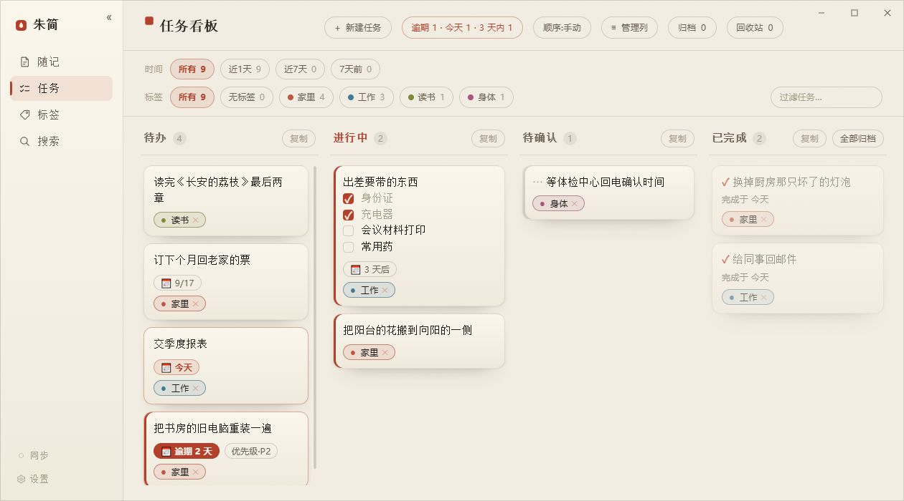

# Zhujian (朱简)

> **English** · [简体中文](readme.md)

Zhujian is a tool for notes and tasks. Jot a thought down; when it becomes something to do, turn it into a task and see it through. Your data stays on your own device, and the app works offline.



- **Download**: Windows and Android are the supported builds, at [zhujian.app](https://zhujian.app); the HarmonyOS build is on [Huawei AppGallery](https://appgallery.huawei.com/app/detail?id=C6917614407069105862); macOS and Linux are early builds.
- **Free to use · Open source (MIT)** · No sign-up.
- **No AI features, and no dependency on large language models**: from noting something down to getting it done, every step is yours.

> There is no AI in the product; the product was written by me and an AI.

The name joins *zhūshā* (朱砂, cinnabar) and *jiǎndú* (简牍, the bamboo and wooden slips written on before paper): red ink on a short strip, for the small things worth keeping. The second character also carries the sense of plain and simple.

```
jot it down → Notes → make it a task → get it done on the board
```

The handful of things worth understanding before you rely on them — the recovery code, the backup code, what removing a device actually does, what direct sync over Wi-Fi costs you, the version gate on custom columns, and how ticking a checkbox behaves offline — are all written down in the [user guide](docs/user-guide.md) (Chinese), with nothing left out.

## Features

### Jot it down

- Some things arrive as a single sentence, at a moment when you have no time to sort them out. Zhujian catches that sentence first: it opens straight into a text box, closes when you are done, and does not interrupt what you were doing.
- On the desktop, `Ctrl+Alt+N` brings up a slip; press Enter and it is saved to Notes, and the window goes away on its own. `Ctrl+Alt+M` opens the main window on whichever view you left it. Both hotkeys are rebindable under Settings → Shortcuts (change one if it clashes with another app; a clash no longer keeps the app from starting). You can also double-click the tray icon for the main window, or right-click it for the menu.
- On the phone, tap the round button at the bottom to write, then tap "Note it" to go back to the list.
- **Attach images**: on the desktop, paste a screenshot with `Ctrl+V`; on the phone, use "+ Image" to pick from the gallery or "+ Photo" to take one. One item can hold several; each is badged `Image 1`, `Image 2`, and tapping opens it full size.
- **Checklists in the body**: start a line with `- [ ] buy milk` and it renders as a tappable box — tick it and the line goes faint. Good for splitting one thing into a few small steps.
- In the desktop capture slip, type `/` at the start of a line for commands: `/task` files this one straight onto the board, `/tag family` attaches a tag, `/space` picks which space it lands in. Ordinary text that happens to start with `/` (say `/etc/hosts`) does not trigger anything.

### Notes

- What you jot down is arranged into a timeline by day — today, yesterday, earlier — so you can see at a glance what has been on your mind.
- Once there is a lot, filter by tag or type to filter by text; the two stack.
- Every note can be edited, and the version from before each change is kept automatically, so the original is never written over.
- Deleting is a soft delete into the trash; restore any time. To destroy something for good, confirm once more inside the trash.
- Tagged and untagged notes live in one list — a tag is just handy metadata.

### Making tasks · the board

- A note you have thought through becomes a task in one step, leaving Notes for the board. Same content, different gear, no copy; a task in **To do** can be sent back to Notes.
- Four columns by default: **To do / In progress / To confirm / Done**. Drag to change state, or drag within a column to reorder.
- **To confirm** is for "I am done, I am waiting to hear back". If you have no use for it, rename it or delete it.
- **The columns are yours to change**: add, rename, reorder and delete them on the desktop, and they sync to your other devices.
- Cards carry a due date, a priority and tags; overdue and due-today are highlighted. A summary button at the top reads "M overdue · N today · K within 3 days" and collapses the board to just those cards. On the desktop the app can also post one system notification a day with those numbers.
- Done cards show **when** they were finished; sending one back or archiving it preserves that moment.
- Finished tasks go to the **Archive**, grouped into a timeline by the day the work was done. They can be read but not deleted (to delete, un-archive back to the board first — one extra step, on purpose). Archiving is not deleting; the two have separate doors.
- On the desktop, hovering a card pops a ⋯ cheat sheet with one key per action: Edit `E` / Copy `C` / Tags `L` / Due `S` / Priority `P` / Send back `B` / Delete `D` / `]` next column / `[` previous column. Double-click = edit. Note cards use the same scheme.

### Tags

- Lightweight classification; one item can carry several tags.
- Each tag's row shows how many notes and tasks are under it; click to expand in place.
- Create, rename, delete and merge by hand (merging folds scattered tags into one); drag the handle to reorder, and your order is followed everywhere.
- A tag can be given a **kind** (free text — "person", say), for grouping by kind later.
- For hierarchy, name with a slash: `work/reports` is indented under `work` in the list.

### Search

- Find anything by content across Notes, Tasks, Trash and the Archive, **including versions you have since edited away**, with matches highlighted.

### Spaces

- A space is a completely separate notebook: its own notes, board, tags and search, and its own sync account.
- Keep "Personal" and "Family" apart, with nothing mixed across them; an item filed in the wrong place can be **moved** to another space.

### Multi-device sync (optional)

- Sync notes and tasks between desktop and phone. It defaults to the official server, `sync.zhujian.app`, and you can point it at your own instead. Unconfigured, the whole feature stays silent.
- No email address, no phone number: the first device taps **Create account** and receives a **recovery code**; other devices join with a pairing code and get the full dataset.
- Content is encrypted on your device before it leaves; the server only ever handles ciphertext and cannot read it.
- Two devices on the same Wi-Fi sync directly, peer to peer — faster, and it keeps working when the router has no internet.
- The sync panel holds the current **device list** for the space. Name each device and items will carry a faint note saying which one wrote them.

### Appearance

- Light / dark in three settings: follow the system, always light, always dark. This device only; it does not sync.
- Interface text size is per-device too: `Ctrl +` / `Ctrl -` / `Ctrl 0` on the desktop, Settings → Text size on the phone.

### What this version does not have

Said plainly, so you do not find out after installing:

- No ads, no splash screen, no push notifications, no memberships and no in-app purchases.
- It does not look at your location, contacts, messages or call log, and it does not read your photo library: picking an image on the phone goes through the system picker, and only the ones you tap are taken.
- No third-party analytics, no user profiling, no personalised recommendations.
- Encrypted backups are desktop-only for now, and manual — one click, one backup. Scheduled backups and one-click restore are not built yet.
- On the desktop, updates are checked for and offered automatically; on the phone, installing the update takes a tap from you.

### Price

Free to use, multi-device sync included, no in-app purchases.

### About your data

- Your content lives on this device. Uninstalling on the phone clears it along with the app; on the desktop, uninstalling leaves the data folder and the backup key behind for you to remove by hand. Either way, keep your own backup first.
- With sync off, the only place the app talks to is `zhujian.app`, to check for new versions.
- "Your data is not lost" means this software will not silently lose what you wrote (edits keep history, deletes go to the trash). It does not mean a dead disk can be recovered from — that takes a copy you keep yourself.

### About open source

The code is released under MIT — this repository.

## Stack

| Layer | Choice |
|---|---|
| Desktop shell | Tauri v2 (Rust backend + WebView frontend) |
| Frontend | Vite + TypeScript (vanilla, no framework) |
| Storage | SQLite (rusqlite, bundled) |
| How you summon it | Global hotkeys (rebindable) + the system tray; both windows start hidden |

## Development

Prerequisites: Node, Rust (rustup stable-msvc), the WebView2 runtime, the VS2022 C++ toolset.

```bash
npm install          # frontend dependencies (including the Tauri CLI)
npm run tauri dev    # dev mode (starts vite:1420 and the app together)
npm run tauri build  # release build (frontend embedded in a standalone exe)
```

> ⚠️ **Do not run `src-tauri/target/debug/app.exe` directly**: the debug build's WebView points at the dev
> server on `localhost:1420`, so without vite running you get "localhost refused to connect". Use
> `tauri dev` for development and `tauri build` when you want a standalone executable.
>
> The app lives in the tray and both windows default to `visible:false` — get in by double-clicking the tray
> (or "Open Zhujian" in its right-click menu), or with `Ctrl+Alt+N` (capture) or `Ctrl+Alt+M` (main window).

### Code map

```
index.html / src/main.ts          the capture slip (its own window)
notebook.html / src/notebook.ts   main window shell (sidebar + view registry + single-window navigation)
src/{inbox,board,topics,search}.ts  the four views: Notes / board / tags / global search
src/{item-images,checklist,hotkey-menu,clipboard,tasktime}.ts  shared cross-view controllers
src/theme.css                     the single source of truth for design tokens (paper and cinnabar)
core/                             zhujian-core: data layer + sync client, zero Tauri coupling, a path
                                  dependency of both shells; migrations/ holds the numbered SQL
src-tauri/ · android/ · ohos/     the three platform shells (hotkeys, tray, windows, command surface)
sync-proto/ · server/             sync envelope layer + zhujian-syncd, the self-hosted zero-knowledge relay
e2e/ · site/                      real GUI e2e (WebdriverIO) · the zhujian.app site (one file, no build)
```

## Tests / verification

- **Logic**: `cd core && cargo test` (all backend tests live in the shared `zhujian-core` crate, including folded proofs that every migration loses nothing, a convergence property test for the sync engine, and end-to-end tests of two libraries against a real sync server). Separate crates: `cd src-tauri && cargo test` / `cd sync-proto && cargo test` / `cd server && cargo test` / `cd android/src-tauri && cargo test`.
- **Real GUI e2e**: `npm run test:e2e` — WebdriverIO → tauri-driver → msedgedriver → a real WebView2, with real clicks, real IPC and real SQLite.
  - **fast (day-to-day)**: in another terminal run `npm run dev` (**vite only — not `tauri dev`**, which grabs the `Ctrl+Alt+N` global hotkey and makes the e2e app panic), then `YS_E2E_FAST=1 npm run test:e2e`.
  - **release (final check)**: `npm run tauri build -- --no-bundle`, then `npm run test:e2e` (the default; self-contained, no vite needed). Stop the dev server first here too.
  - Isolation: e2e uses a temporary database at `%TEMP%\ys-nb-e2e.sqlite3` (emptied each run) and **never touches your real notebook**.
  - Dependencies: `tauri-driver` (`cargo install tauri-driver`) and `e2e/drivers/msedgedriver.exe` (**not in the repository**; download the Edge WebDriver matching your local WebView2 runtime and put it at that path).
- **Look inside the database**: `node --experimental-sqlite scripts/verify-db.mjs`; the database lives at `%APPDATA%\app.zhujian.notebook\notebook.sqlite3` (overridable with `YS_DB_PATH`, which e2e uses).

> If crates.io is hard to reach from your network, add your own `.cargo/config.toml` with a proxy
> (not in the repository — it is machine-local configuration).

## Data model, in brief

- Primary keys are all **ULIDs** (TEXT) and timestamps are RFC3339 UTC TEXT; `due_on` is the exception, a local calendar day `YYYY-MM-DD` (a deadline is an intent about a calendar day, so storing a UTC instant would put it a day off).
- **One entity**: a note and a task are **the same `items` row in a different `stage`** (`inbox` / `filed` | `todo` / `doing` / `confirming` / `done`), not two records. **Making a task = flipping the stage to `todo`, with no copy**; sending it back flips it to `inbox`/`filed`. Rows in a task stage never appear in the note views, so there is nothing to de-duplicate. `archived_at` is the trash axis (it freezes the stage and restores to it), and the frontend splits the trash into "notes" and "tasks" by that frozen stage.
- **Separated concepts**: `items.stage` is the gear in the flow (note ↔ task); `topics` + `item_topic` (M:N) are tags (called "tags" to the user; a task can carry several and shows up under each).
- **Immutability is historical, not per-row**: you **can** edit your own items, and before each change a DB trigger archives the previous version into `item_revisions` (append-only, unrewritable) **across every stage** (editing a task title archives too). The one exception is a **tick-only change** — where the only character that moved is the one inside a checkbox (migration 0039); the predicate lives in `core/src/checklist.rs` and is only ever allowed to get narrower.
- **Deleting is the user's prerogative, with graduated fail-safes**: what is guarded against is accidental or silent destruction, not you clearing out your own data. **Deleting means the trash; destruction only happens inside the trash**: every delete is a soft delete (setting `archived_at`, restorable to its original gear), and only a confirmed **Delete forever** in the trash actually removes it (cascading tags and history). Notes and tasks share this one axis, and the storage-layer guards still stand: filed notes and tasks cannot be hard-deleted at the database level while active.
- **`topics` (tags) is a recomputable projection**: a manual merge (`merge_topics`) rewrites membership in `item_topic` and folds scattered tags into the surviving one without keeping membership history — no item is lost and no content is touched.
- Every connection runs `PRAGMA foreign_keys = ON`, and link tables are `ON DELETE CASCADE`. There is no catch-all metadata JSON column; extensions go through explicit, numbered migrations in `core/migrations/`, which are only ever added to.

## Design rules

- **Strictly manual**: every step a note takes (tagging / making a task / sending back / deleting) is a transaction the user starts by hand. Nothing decides anything on your behalf.
- **Fail fast**: production code never writes silent fallbacks or default values; an illegal operation rolls the whole transaction back and reports.
- **Only "your data is not lost" guarantees are kept**: history archiving and the ban on directly deleting filed items stay. The "lock down the flow" triggers written to stop the system from silently changing data are gone, in exchange for flexibility and lower maintenance.
- **Style**: light, minimal, paper and cinnabar (warm paper, dark ink, cinnabar accents; body text in a serif, interface text in a sans).

## Contact

Questions or suggestions: 3069848@qq.com.

## Licence

The code is released under [MIT](LICENSE). The name "Zhujian" (朱简, formerly 朱笺), the seal icon and the `zhujian.app` domain are brand marks and are **not** covered by the code licence — if you deploy or distribute a derivative, please change the name and the mark. Official downloads and the sync service are at [zhujian.app](https://zhujian.app).
